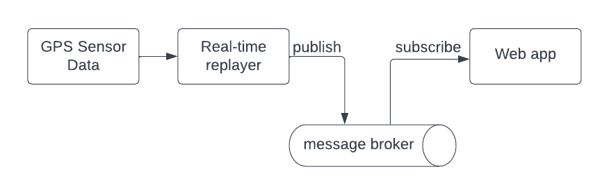

# Data-intensive applications using microservices

CE290I - Control and information management
Systems Engineering, UC Berkeley


Elói Pereira


November 18, 2024

---
# About me


* Head of Data Science at [Car IQ Inc](https://www.cariqpay.com)
* 10 years at Portuguese Air Force Academy
* 5 years at Air Force Metrology Lab
* PhD in Systems Engineering, UC Berkeley
* Interested in: DS, DE, AI, ML, mobile robotics, environmental monitoring, digital payments...

[eloipereira.com](https://www.eloipereira.com)
[github](https://github.com/eloipereira)
[linkedin](https://linkedin.com/in/eloipereira)

---
# Data-intensive applications

* Applications that process large volumes of data, typically in real time or near-real time
* Examples: recommendation engines, fraud detection, real-time analytics, and scientific research.
* Large heterogeneous stacks, comprised by different services developed by different teams, SW Eng, DE, DS, ML, etc.
* Must meet hard requirements on scale, performance, and security
* Microservices architectures have been widely adopted for data-intensive applications
---

<span style="color:white">
<h1> Why not Monoliths?!</h1>
Everybody used to love them!
</span>


<span style="color:white;position:absolute;float:right;left:80px;top:650px;">
Source: 2001: a space odyssey
</span>


---
# Monolithic Architectures: the good

* Traditional software architecture
* All the components are tightly integrated and packaged together
* Application is built, deployed, and scaled as a single unit
* Single codebase
* Small dev footprint: programming languages, tools, and platforms
* Easy to deploy
* Easy to document
* Easy to understand

---
# Monolithic Architectures: the bad

* Difficult to maintain as the application grows in size and functionality
* Difficult to handle legacy code
* Difficult to introduce new features
* Developers need to understand in depth the overall application
* The entire application needs to be scaled together
* Any changes or updates require redeploying the entire application

---
<span style="color:white">
<h1>Microservices</h1>
</span>


<span style="color:white;position:absolute;float:right;left:80px;top:600px;">
Source: Blade Runner
</span>

---
# Microservices Architectures

* Independently developed, deployed, and managed
* Easy to maintain and evolve
* Scalable and reliable
* Containerization makes them agnostic to the infrastructure
* Easy to deploy in the cloud
* Flexible and agile

---

# Why using containers?

* **Isolation**: Allows each microservice to run in its own container, ensuring that services are isolated from each other
* **Scalability**: Can be easily scaled up or down to meet demand. Microservices can be replicated or replaced independently
* **Portability**: Ensure that microservices can run consistently across different environments. No more “it works on my machine.”
*	**Consistency**: Guarantees the same runtime environment everywhere (local machines, servers, cloud, etc).

---

# Why using containers?

* **Automation and CI/CD**: Integrates seamlessly with continuous integration and continuous deployment pipelines, enabling automated testing, building, and deployment of microservices.
* **Efficient Resource Utilization**: Docker containers are lightweight, allowing multiple microservices to run on the same host efficiently without significant overhead.
* **Simplified Management**: Orchestrators like Kubernetes help manage and deploy microservices at scale, providing features like load balancing, service discovery, and automatic scaling.

---

# Docker containers
* Platform for building, shipping, and running containerized applications.
* It uses lightweight containers that are portable and isolated, making them easy to deploy and scale.
* Docker containers share the operating system kernel, but run as isolated processes, which makes them efficient and secure
* Docker is a popular choice for running applications in production
* Docker can be used to run a wide variety of applications, including web applications, databases, and microservices.

---
# The Simplest Microservice

* Listener: receives and prints messages sent by publishers
* Publishers: send messages to the listener

- Clone the git repo
  - [https://github.com/eloipereira/ce290i-microservices](https://github.com/eloipereira/ce290i-microservices)
- Navigate to `simplest-microservice` and follow the instructions in `README.md`

---
# Listener and Publisher Dockerfiles

```Dockerfile
# dockerfile.listener
FROM alpine:latest
RUN apk add --no-cache socat
CMD ["sh", "-c", "socat TCP-LISTEN:12345,reuseaddr,fork -"]
```

```Dockerfile
# dockerfile.publisher
FROM alpine:latest
RUN apk add --no-cache socat
ENV PUB_NAME="Publisher"
CMD ["sh", "-c", "while true; do echo \"Hello from ${PUB_NAME}! $(date)\"; sleep 1; done | socat - TCP:listener:12345"]
```
---

# Build and run

```bash
> docker build -t listener -f dockerfile.listener .

> docker build -t publisher -f dockerfile.publisher .

> docker network create my-network

> docker run --rm --name listener --network my-network -t listener

> docker run --rm --name publisher1 --network my-network -t publisher

> docker run --rm --name publisher2 --network my-network -t publisher
```
---

# Docker compose

* Command-line tool for defining and running multi-container Docker applications
* Takes a YAML file defining and configuring the services of your application, builds and runs all the services
* Docker Compose makes it easy to define and manage complex multi-container applications
* It also makes it easy to share your applications with other developers or deploy them to production

---

# docker-compose.yml

```yaml
services:
  listener:
    build:
      context: .
      dockerfile: ./dockerfile.listener
    container_name: listener
    networks:
      - my-network
  publisher1:
    build:
      context: .
      dockerfile: ./dockerfile.publisher
    container_name: publisher1
    networks:
      - my-network
    depends_on:
      - listener
...
```

---

# docker-compose.yml

```yaml
...
  publisher2:
    build:
      context: .
      dockerfile: ./dockerfile.publisher
    container_name: publisher2
    networks:
      - my-network
    depends_on:
      - listener
networks:
  my-network:
    driver: bridge
```

---

<!--
 # A simple example - GPS Replay

* Read a GPS sensor data from a csv file and replay it in real-time
* Serve the current state to downstream applications, e.g.:
  * A web app dashboard
  * A monitoring tool
  * etc.

---
# Docker containers
* Create a function named `replay_gps_from_csv` that reads `dataset_gps.csv` and replays the GPS data in real-time, printing the result in the command line
* Create a script named `replay_and_print.py`
* Create a dockerfile named `dockerfile.replayer_print` that runs `replay_and_print.py`
* Build and run your container using `docker build` and `docker run`
* Inspect your container using `docker exec`

---
# Put everything together with Docker compose
* Create a YAML file named `docker-compose-multi-replayer.yml` with three services, each one being an instance of `dockerfile.replayer_print`
* Build and run your multi-container application using `docker compose build` and `docker compose up`
---
-->

# Client-service REST Microservices
- REST (Representational State Transfer) is a set of architectural principles for designing networked applications based on HTTP
- REST Microservices communicate with each other over HTTP, using HTTP methods (i.e., GET, POST, PUT, and DELETE)
- They exchange data in a lightweight format such as JSON or XML
---
# REST-based GPS Replayer
* Backend microservice
  * Real-time replayer
  * Cache to share state
  * REST API for serving current values
* Frontend microservice
  * Web app requests current values and displays them


---
# Building and running

- Clone the git repo
  - [https://github.com/eloipereira/ce290i-microservices](https://github.com/eloipereira/ce290i-microservices)
- From your favorite CLI:
  - Build: `docker compose -f docker-compose-rest.yml build`
  - Run: `docker compose -f docker-compose-rest.yml up`
  - Stop: `docker compose -f docker-compose-rest.yml down`
- Open streamlit app: [http://localhost:8501/](http://localhost:8501/)

---
# REST API

- REST API documentation at [http://localhost:8000/docs](http://localhost:8000/docs)
- GET /gps_state
  `curl http://localhost:8000/gps_state`
- GET /compute_avg_speed
  `http://localhost:8000/compute_avg_speed?time_window_seconds=10`

---
# REST API: non-blocking

- POST /request_to_compute_avg_speed
`
curl -X 'POST' http://localhost:8000/request_to_compute_avg_speed?time_window_seconds=10
`
- GET /get_avg_speed_task_status
`http://localhost:8000/get_avg_speed_task_status?task_id=<uuid>`

---
# Event-driven microservices
- In event-driven microservices, services communicate and interact with each other by sending messages or reacting upon messages being received
- This architecture allows for asynchronous communication between services, where services can react to events in real-time
- It also enables scalability and fault tolerance, as services can be added or removed without impacting the overall system

---
#  Publish-subscribe (pub-sub)

* Asynchronous communication pattern where senders, known as **publishers**, send messages to a message broker.
* The broker then distributes or broadcasts these messages to multiple receivers, known as **subscribers**
* Publishers do not need to have knowledge of the subscribers
* Publishers and subscribers communicate through topics or channels


---
# Event-driven GPS Replayer
* Redis as pub-sub broker
* GPS replayer service publishes to the redis broker on a topic named `gps_state`
* Streamlit web app subscribes to the `gps_state` topic and reacts upon any message received


---
# Building and running
- From your favorite CLI:
  - Build: `docker compose -f docker-compose-pubsub.yml build`
  - Run: `docker compose -f docker-compose-pubsub.yml up`
  - Stop: `docker compose -f docker-compose-pubsub.yml down`
- Open streamlit app: [http://localhost:8502/](http://localhost:8502/)

---
# Conclusion
* Data-intensive applications process large volumes of data and have hard requirements on scale, performance, and security
* They have often large heterogeneous stacks, developed by different teams, such as SW eng, DE, DS, ML, etc
* Microservices architectures have been widely adopted for data-intensive applications
* REST APIs are used whenever the client needs data per request
* Event-driven applications are used whenever the client must react to events in real-time


---
# Development Tools

- [Git](https://git-scm.com/downloads): distributed version control system
- [Docker](https://docs.docker.com/engine/install/): platform as a service
- [Python](https://www.python.org/), Version: 3.12:  programming language
- [FastAPI](https://fastapi.tiangolo.com/): API web framework
- [Pydantic](https://docs.pydantic.dev/latest/): data validation
- [Uvicorn](https://www.uvicorn.org/): web server
- [Streamlit](): App web framework
- [Redis](https://redis.io/): in-memory database and message broker

---
# Development tools (optional)

- [Pyenv](https://github.com/pyenv/pyenv): Python version management
- [VSCode](https://code.visualstudio.com/download): Editor
- Pylance: python support for VSCode
- Flake8: linter
- Black: formatter
- Pre-commit: code validation
- Marp to build this presentation

---
